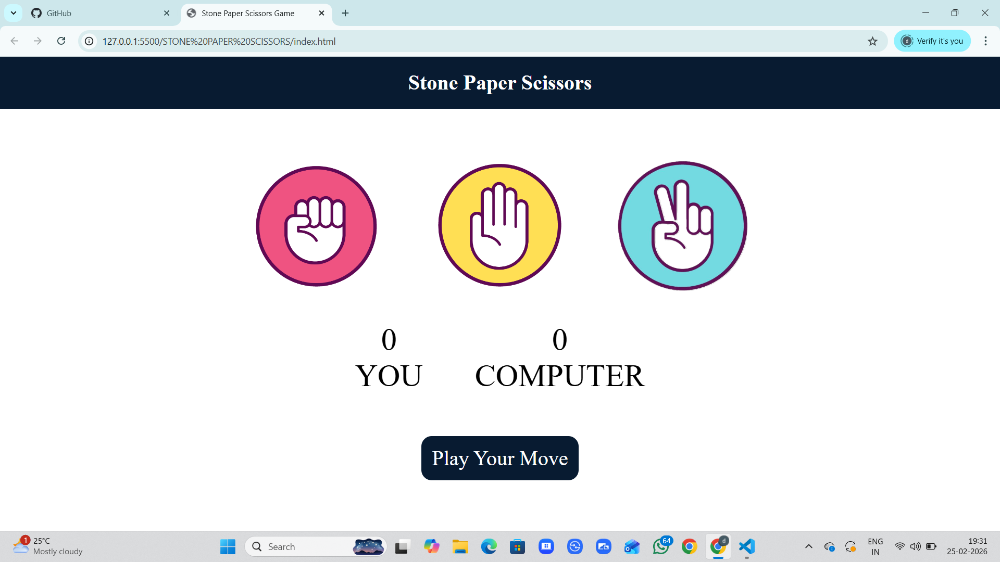

# ✊✋✌️ Stone Paper Scissors Game

A fully functional and interactive **Stone Paper Scissors (Rock Paper Scissors) Game** built using **HTML, CSS, and JavaScript**.  
This project demonstrates core JavaScript concepts like DOM manipulation, event handling, game logic implementation, and dynamic UI updates.

---

## 🚀 Live Demo
  https://deepanshudevsinghal.github.io/stone-paper-scissors/

----

 ## 🚀 Github Repository

 Project Source Code :
 https://github.com/deepanshudevsinghal/stone-paper-scissors.git

----

## 🚀 Screenshots

## 📸 Preview

----

## 📌 Features

- ✅ Player vs Computer gameplay
- ✅ Random computer choice generation
- ✅ Instant result display (Win / Lose / Draw)
- ✅ Score tracking system
- ✅ Reset game functionality
- ✅ Responsive design (Mobile + Tablet + Desktop)
- ✅ Interactive and user-friendly UI

---

## 🛠️ Technologies Used

- **HTML5** – Structure of the game
- **CSS3** – Styling and layout
- **JavaScript (Vanilla JS)** – Game logic and interactivity

---

## 🧠 Game Logic

- The player selects Stone, Paper, or Scissors.
- The computer randomly generates its choice.
- The game compares both choices based on predefined rules:
  - Stone beats Scissors
  - Scissors beats Paper
  - Paper beats Stone
- The result is displayed instantly.
- Scores are updated dynamically after each round.

---

## 📂 Project Structure

stone-paper-scissors/
│
├── index.html
├── style.css
├── script.js
└── README.md

---

## 🎯 Learning Outcomes

Through this project, I improved my understanding of:

- DOM Manipulation
- Event Listeners
- Conditional Statements
- Random number generation
- Score tracking logic
- Responsive Web Design

---

## 🌟 Future Improvements

- Add animations and sound effects
- Add difficulty levels
- Add multiplayer mode
- Improve UI transitions

---

## 💡 Author

**Deepanshu Singhal**  
Frontend Developer | HTML | CSS | JavaScript

---

⭐ If you like this project, feel free to give it a star!